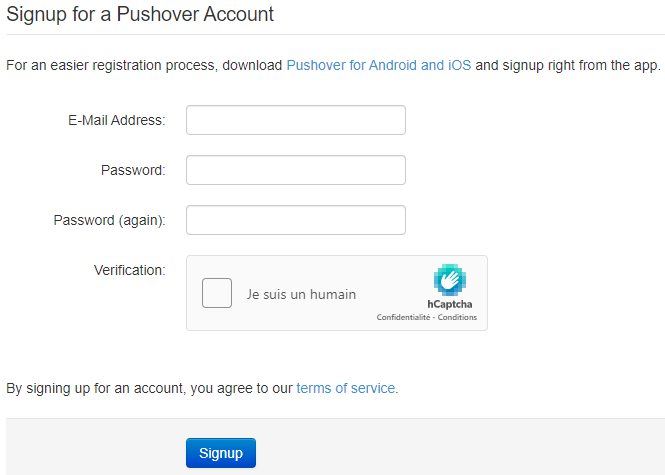
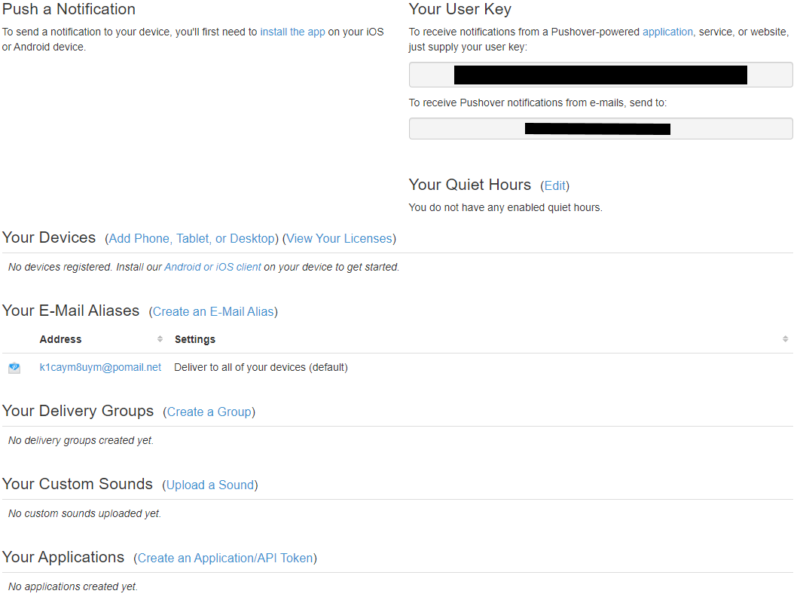
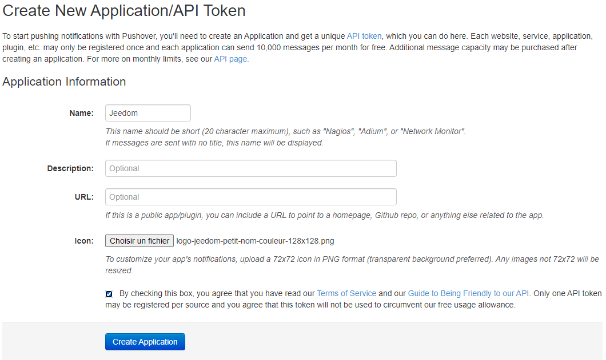
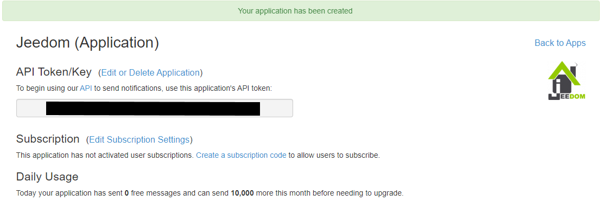
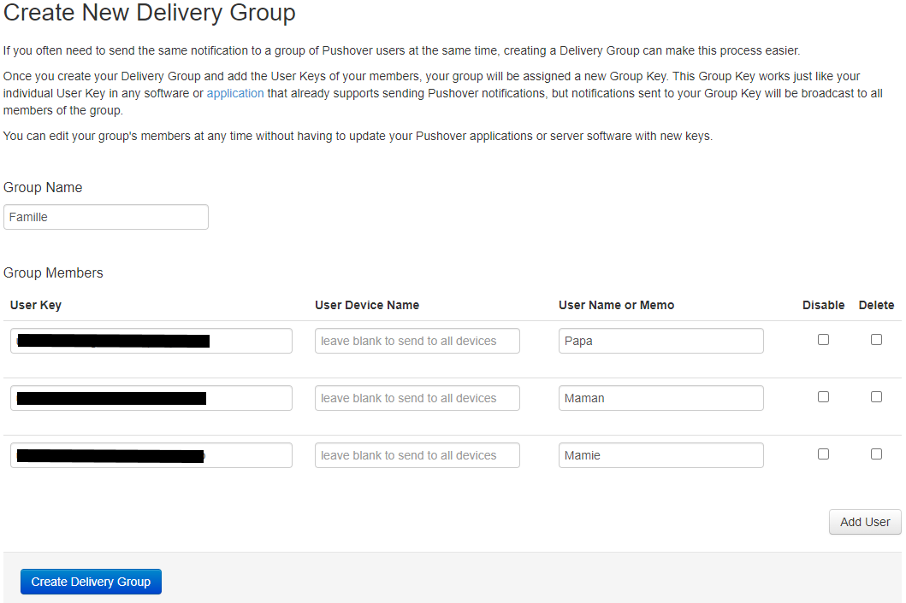

# Plugin Pushover2 - BETA

## Description

Plugin to send pushover notifications [Pushover](https://pushover.net/) from **Jeedom**.

Largely inspired by the excellent work of [rsimonfr](https://github.com/rsimonfr/jeedom-plugin-pushover)
and adapted for Jeedom V4.

## Prerequisites

To use this plugin, you must have a Pushover account (to receive notifications)
and have created a Pushover application (to send notifications). A small instruction manual
is available at the bottom of this page.

## Installation

- Download the plugin from the market
- Activate the plugin

## Equipment configuration

The configuration of Pushover2 devices is accessible from the menu Plugins → Communication.

Here you will find all the configuration of your equipment:

- **Equipment name**: name of your equipment.
- Parent object**: indicates the parent object to which the equipment belongs.
- Activate**: allows you to make your equipment active.
- Visible**: makes your equipment visible on the dashboard.

Below you will find the specific parameter of your equipment:

- User Key or PUSHOVER Group**: Put here your "User Key" visible on your pushover account.

### Commands

- **Name**: the name of the command displayed on the dashboard.
- **Application Token**: copy here the token of the application created in pushover.
- **Device** : empty by default to send the notification on all devices linked to the pushover account.
- **Priority** : the priority of the notification. For more info, see the [Pushover documentation](https://pushover.net/api#priority)
- **Relay** : only for the "Urgent" priority. Duration in seconds between 2 notification sendings until acknowledgement.
- **Deadline** : only for the "Urgent" priority. Time in seconds after which Pushover stops sending the alert if not acknowledged.
- **Ringtone** : sound to be played on the devices during notification. This list also retrieves personal sounds added from Pushover.

> Default commands
>
> - **Last Status** : binary that indicates if the last notification is sent to Pushover.
> - **Last Request ID**: unique identifier of the last notification accepted by Pushover.
> - **Last Urgent ID**: unique identifier of the urgent notification sent.
> - **Urgent Confirmation**: binary that indicates whether the last urgent notification was acknowledged.
> - **Confirmation by**: key of the user who acknowledged the emergency.
> - **Confirmation at** : date and time of the acknowledgement.
> - **Confirmation from** : from which user's device the acknowledgement has been made.
> - **Confirmed message ID**: unique identifier of the acknowledged notification.

## Using the plugin

- Create a new Pushover device.
- Enter in the field **User Key or PUSHOVER Group** your "User Key" Pushover.
- Go to the commands tab.
- Create one (or more) new command by entering in the **Application Token** field
the "API Token" provided by Pushover.
- Customize the notification: Priority / Ringtone.

- You now have "Action / Message" commands to use in the Core alerts, the Camera plugin, your Scenarios...

---
## Create a Pushover account

Create an account on Pushover if you haven't already done so. [Pushover](https://pushover.net/signup)

A new page appears with the user ID to put in the plugin.

### Création d'une application Pushover

Now create an application. Click on **(Create an Application/API Token)**

A new page appears with the API Token to put in the plugin.

### Creating a Pushover group

To create a recipient group, click on**(Create a Group)**

A new page appears with the ID of the group to put in the plugin.
