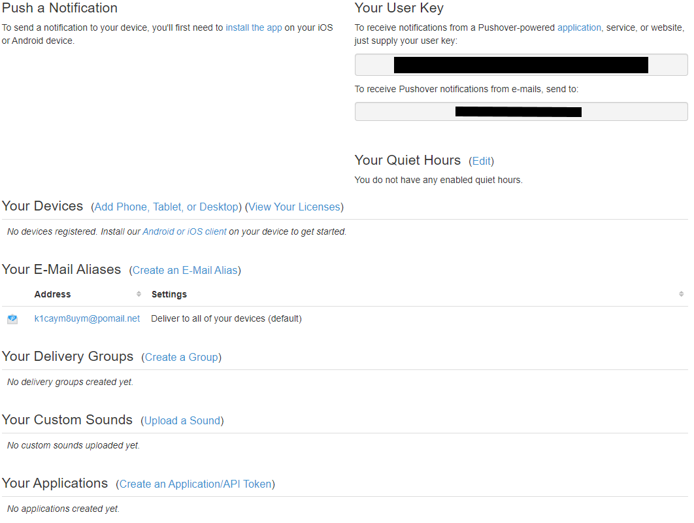

# Plugin Pushover2 - BETA

## Descripción

Plugin para el envío de notificaciones push [Pushover](https://pushover.net/) desde **Jeedom**.

Inspirado en gran medida en el excelente trabajo de [rsimonfr](https://github.com/rsimonfr/jeedom-plugin-pushover)
y adaptado para Jeedom V4.

## Requisitos previos

Para utilizar este plugin, debes tener una cuenta de Pushover (para recibir notificaciones)
y he creado una aplicación Pushover (para enviar notificaciones). Un breve manual de instrucciones
está disponible al final de esta página.

## Instalación

- Descargue el plugin del mercado
- Activar el plugin

## Configuración del equipo

La configuración de los dispositivos Pushover2 es accesible desde el menú Plugins → Comunicación.

Aquí encontrarás toda la configuración de tu equipo:

- **Nombre del equipo**: nombre de su equipo.
- **Objeto padre**: indica el objeto padre al que pertenece el equipo.
- **Activar**: Permite activar el equipo.
- **Visible**: hace que su equipo sea visible en el salpicadero.

Debajo encontrará el parámetro específico de su equipo:

- **Clave de usuario o grupo PUSHOVER**: Ponga aquí su "Clave de usuario" visible en su cuenta pushover.

### Los pedidos

- **Nombre**: el nombre del comando que se muestra en el tablero.
- **Token de la aplicación**: copie aquí el token de la aplicación creada en pushover.
- **Dispositivo**: vacío por defecto para enviar la notificación a todos los dispositivos vinculados a la cuenta de pushover.
- **Prioridad**: la prioridad de la notificación. Para más información, consulte la [documentación de Pushover](https://pushover.net/api#priority)
- **Relé** : sólo para la prioridad "Urgente". Tiempo en segundos entre 2 envíos de notificaciones hasta el acuse de recibo.
- **Plazo**: sólo para la prioridad "Urgente". Tiempo en segundos después del cual Pushover deja de enviar la alerta si no se reconoce.
- **Tono de llamada**: sonido que se reproducirá en los dispositivos cuando se le notifique. Esta lista también recupera los sonidos personales añadidos desde Pushover.

> Comandos por defecto
>
> - **Último estado**: un binario que indica si la última notificación se está enviando a Pushover.
> - **ID de la última solicitud**: identificador único de la última notificación aceptada por Pushover.
> - **Último ID de emergencia**: identificador único de la notificación urgente enviada.
> - **Confirmación de urgencia**: un binario que indica si la última notificación de urgencia fue reconocida.
> - **Confirmación por**: clave del usuario que ha reconocido la emergencia.
> - **Confirmación en** : fecha y hora del acuse de recibo.
> - **Confirmación de**: desde qué dispositivo del usuario se realizó la confirmación.
> - **ID del mensaje confirmado**: identificador único de la notificación confirmada.

## Uso del plugin

- Crear un nuevo dispositivo Pushover.
- Introduzca su "Clave de Usuario" de Pushover en el campo **Grupo PUSHOVER**.
- Ve a la pestaña de comandos.
- Cree un nuevo comando (o comandos) introduciendo en el campo **Token de aplicación**.
el "API Token" proporcionado por Pushover.
- Personalizar la notificación: Prioridad / Tono de llamada.

- Ahora tienes comandos de "Acción / Mensaje" para usar en las alertas del Core, el plugin de la Cámara, tus Escenarios...

---
## Crear una cuenta Pushover

Crea una cuenta en Pushover si aún no lo has hecho. [Pushover](https://pushover.net/signup)

Aparece una nueva página con el ID de usuario para poner en el plugin.

### Création d'une application Pushover

Ahora crea una aplicación. Haga clic en **(Crear un token de aplicación/API)**

Aparece una nueva página con el API de Token para poner en el plugin.

### Création d'un groupe Pushover

Para crear un grupo de destinatarios, haga clic en **(Crear un grupo)**.

Aparecerá una nueva página con el ID del grupo a poner en el plugin.
