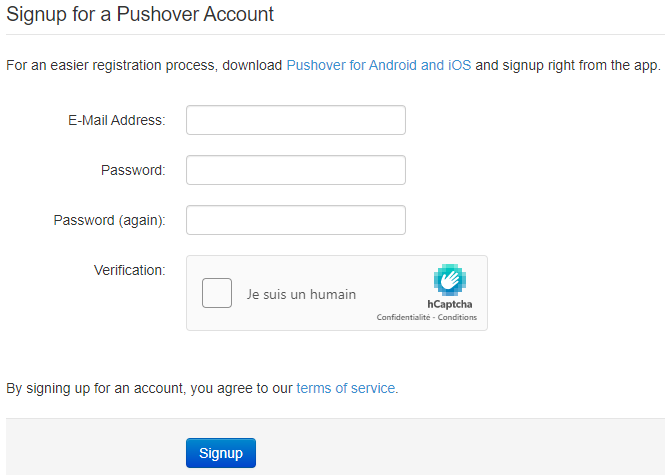
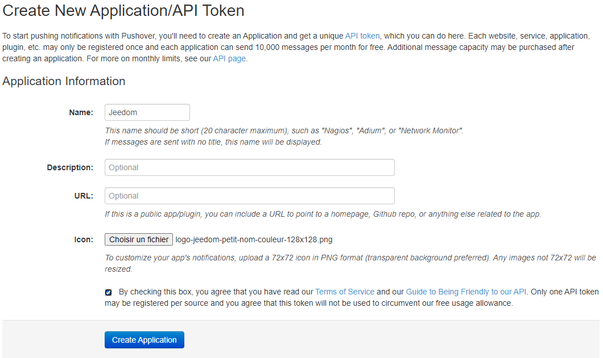
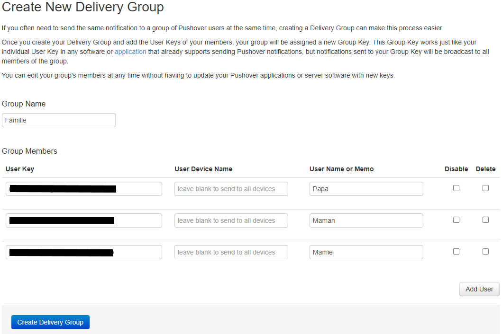

# Plugin Pushover2 - BETA

## Description

Plugin permettant l'envoie de notifications [Pushover](https://pushover.net/) depuis **Jeedom**.

Largement inspiré de l'excellent travail de [rsimonfr](https://github.com/rsimonfr/jeedom-plugin-pushover)
et adapté pour la V4 de Jeedom.

## Pré-Requis

Pour utiliser ce plugin, vous devez avoir un compte Pushover (pour recevoir les notifications) 
et avoir créé une application Pushover (pour envoyer des notifications). Un petit mode d'emploi 
est diponible en bas de cette page.

## Installation 

- Télécharger le plugin depuis le market
- Activer le plugin

## Configuration des équipements

La configuration des équipements Pushover2 est accessible à partir du menu Plugins → Communication.

Vous retrouvez ici toute la configuration de votre équipement :

- **Nom de l’équipement** : nom de votre équipement.
- **Objet parent** : indique l’objet parent auquel appartient l’équipement.
- **Activer** : permet de rendre votre équipement actif.
- **Visible** : rend votre équipement visible sur le dashboard.

En dessous vous retrouvez le paramètre spécifique de votre équipement:

- **Clé utilisateur ou Groupe PUSHOVER**: Mettre ici votre "User Key" visible sur votre compte pushover.

### Les commandes

- **Nom** : le nom de la commande affiché sur le dashboard.
- **Token de l'application** : copier ici le token de l'application créée dans pushover.
- **Appareil** : vide par défaut pour envoie de la notification sur tous les appareils liés au compte pushover.
- **Priorité** : la priorité de la notification. Pour plus d'infos, voir la [documentation Pushover](https://pushover.net/api#priority)
- **Relancer** : uniquement pour la priorité "Urgent". Durée en secondes entre 2 envois de notification jusqu'a acquitement.
- **Echéance** : uniquement pour la priorité "Urgent". Durée en secondes après laquelle Pushover arrete de relancer l'alerte si non acquitté.
- **Sonnerie** : son a jouer sur les appareils lors de notification. Cette liste récupère aussi les sons personnels ajouté depuis Pushover.

> **Commandes par défaut**
>
> - **Dernier Statut** : binaire qui indique si la dernière notification est bien transmise à Pushover.
> - **ID dernière requête** : identifiant unique de la dernière notification acceptée par Pushover.
> - **ID Dernière Urgence** : identifiant unique de la notification urgente envoyée.
> - **Confirmation Urgent** : binaire qui indique si la dernière nofication urgente à été acquitté.
> - **Confirmation par** : clé de l'utilisateur qui à acquitté l'urgence.
> - **Confirmation à** : date et heure de l'acquittement.
> - **Confirmation depuis** : depuis quel appareil de l'utilisateur l'acquitement à été réalisé.
> - **ID message confirmé** : identifiant unique de la notification acquitté.

## Utilisation du plugin

- Créer un nouvel équipement Pushover.
- Entrez dans le champ **Clé utilisateur ou Groupe PUSHOVER** votre "User Key" Pushover.
- Rendez-vous dans l'onglet des commandes.
- Créez une (ou plusieurs) nouvelle commande en entrez dans le champ **Token de l'application** 
l'"API Token" fournie par Pushover.
- Personnalisez la notification: Priorité / Sonnerie.

- Vous avez maintenant des commandes de type "Action / Message" à utiliser dans les alertes du Core, le plugin Caméra, vos Scénarios...

---
## Création d'un compte Pushover

Créer un compte sur Pushover si ce n'est pas deja fait. [Pushover](https://pushover.net/signup)

Une nouvelle page apparait avec l'ID utilisateur a mettre dans le plugin.

### Création d'une application Pushover

Créer maintenant une application. Cliquez sur **(Create an Application/API Token)**

Une nouvelle page apparait avec l'API Token a mettre dans le plugin.

### Création d'un groupe Pushover

Pour créer une groupe de destinataire, cliquez sur **(Create a Group)**

Une nouvelle page apparait avec l'ID du groupe a mettre dans le plugin.
